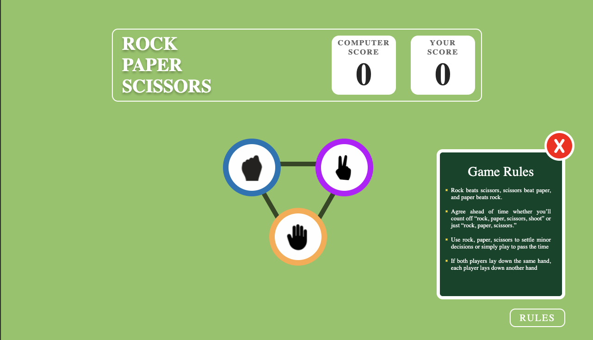
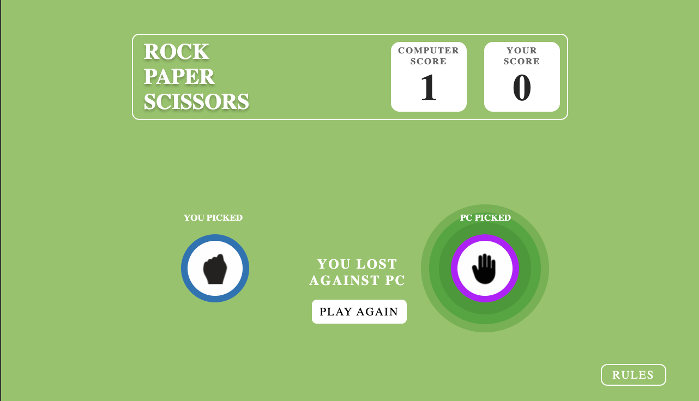
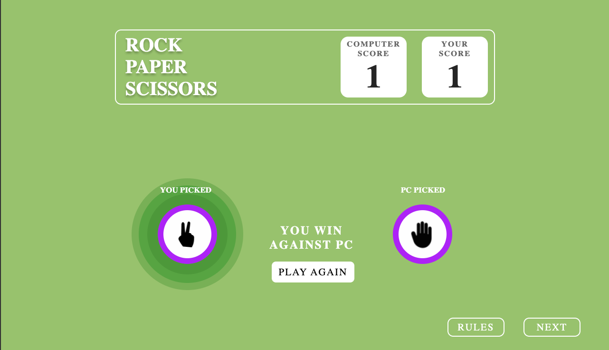
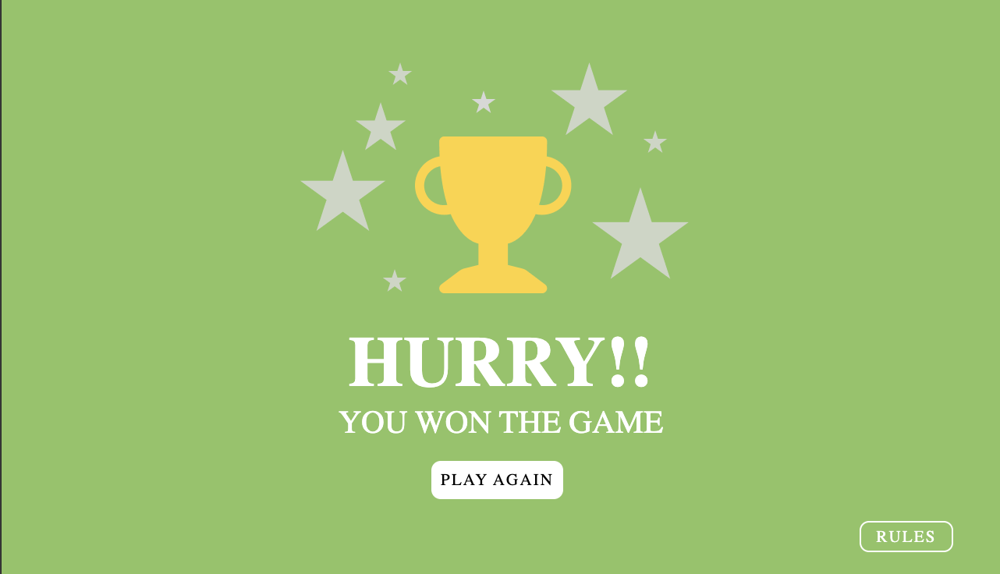

# Rock Paper Scissors Game

A web-based implementation of the classic "Rock, Paper, Scissors" game where users can play against the computer. The game provides an interactive UI with dynamic selection feedback, keeps track of scores, and displays results at the end of the game.

## Features

- **Player vs. Computer**: User can choose between Rock, Paper, or Scissors and play against a computer that selects its option randomly.
- **Score Tracking**: The game tracks and displays both the player's and computer's scores.
- **Stylized UI Feedback**: The game visually updates the user and computer's choices with distinct borders and icons.
- **Game Results**: After each round, the result is displayed (Win, Lose, or Tie).
- **Play Again and Next Round**: The user can replay or continue to the next round at the end of each game.
- **Rules Display**: Option to view the game rules at any time.
- **Final Game Summary**: After several rounds, the game shows whether the player won or lost overall.

## Demo


## Technologies Used

- **HTML5**: For structuring the game interface.
- **CSS3**: For styling and providing visual effects such as borders and shadows.
- **JavaScript (ES6)**: For game logic, user interactions, and dynamically updating the DOM.

## How to Play

1. Select either **Rock**, **Paper**, or **Scissors**.
2. The computer will automatically pick one of the three choices.
3. The result of the round will be displayed (You Win, You Lose, or It's a Tie).
4. You can either **Play Again** or **Go to Next Round**.
5. After a certain number of rounds, a summary will show whether you won or lost overall.

## Setup and Installation

To run the game locally, follow these steps:

1. **Clone the Repository**:

   ```bash
   git clone https://github.com/your-username/rock-paper-scissors-game.git

2. **Navigate to the Project Directory**:

    ```bash
    cd rock-paper-scissors-game

3. **Open the index.html file in your browser**:

    You can do this by simply dragging the file into your browser or running a local development server like Live Server if you are using VS Code.

4. **Start Playing**:
    Enjoy playing the game directly in your browser!


## Screenshots

**Game Start**:






**Result Page**:




